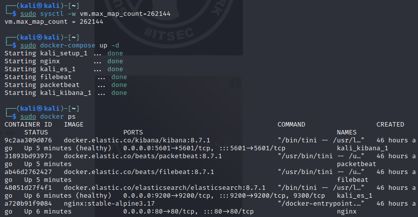
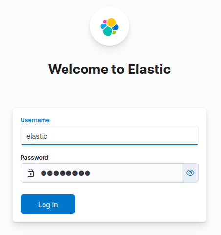
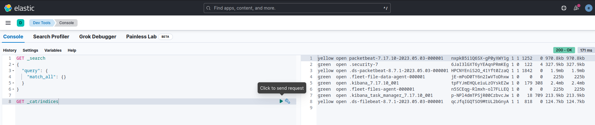
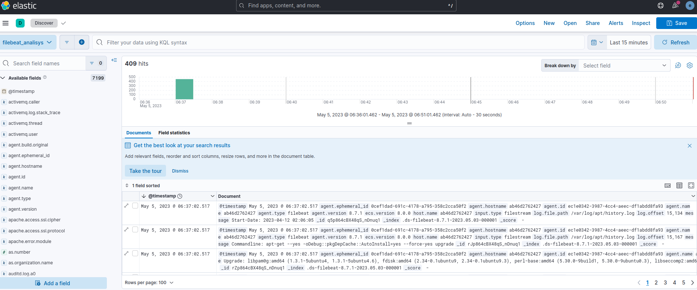
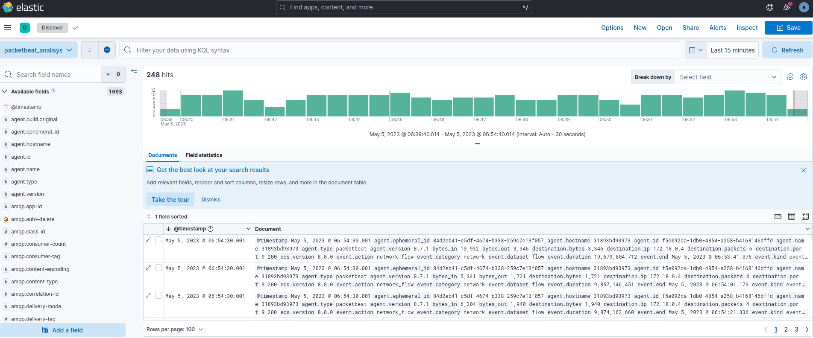

# Развертывание системы мониторинга ELK Stack

## Цель работы

1. Освоить базовые подходы централизованного сбора и накопления информации;

2. Освоить современные инструменты развертывания контейнирозованных приложений;

3. Закрепить знания о современных сетевых протоколах прикладного уровня.

## Ход выполнения практической работы

# Задание 1. Развернуть систему мониторинга на базе ElasticSearch

1. Настройка

Для работы ElasticSearch потребуется увеличить размер виртуальной памяти системы:  

    sudo sysctl -w vm.max_map_count=262144  

Дальше следуем инструкции по ссылке: https://www.elastic.co/guide/en/elasticsearch/reference/current/docker.html

2. После формирования файлов с конфигурациями, нужно запустить образы командой:  

    docker-compose up -d  

3. Переходим на `localhost:5061` и авторизируемся:

4. Проверям, что установленны все средства для сбора информации из файлов журналов и сбора аналитики трафика.

5. Создаем новый data view для filebeat.

6. Создаем новый data view для packetbeat.

## Оценка результата

В результате лабораторной работы была развёрнута система ElasticSearch и настроена система сбора трафика и лог-файлов.

## Вывод

По итогу лабораторной работы была освоена система контейнеризации приложений Docker, работа с Docker-compose и освоена система централизованного сбора и накопления информации. ElasticSearch.
