# Развертывание Threat intelligence Platform OpenCTI

## Цель работы

1. Освоить базовые подходы процессов Threat Intelligence;
2. Освоить современные инструменты развертывания контейнеризованных приложений;
3. Получить навыки поиска информации об угрозах ИБ.

## Ход выполнения работы

1. Подготовка файлов кофигураций

    * Клонируем репозиторий с GitHub:
        ```
        sudo git clone https://github.com/OpenCTI-Platform/docker.git 
        ```

        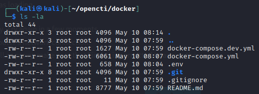 

    * Генерируем UUID:

        ```
        cat /proc/sys/kernel/random/uuid
        ``` 
    
    * Увеличиваем виртуальную память:

        ```
        sudo sysctl -w vm.max_map_count=1048575
        ```

        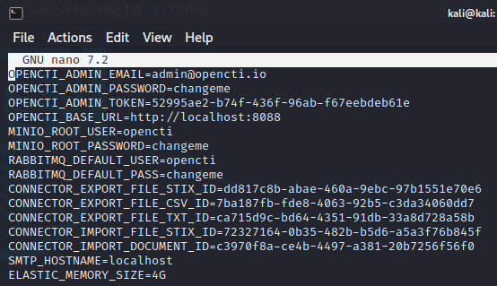  

    * Конфигурируем файл `.env`:

        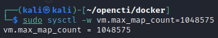  

    * Дополнительная установка ELK:

        ```
        docker pull elastic/elasticsearch:8.6.2
        ```

2. Запуск OpenCTI

    * Запуск контейнера в фоновом режиме:

    ```
    sudo docker-compose up -d
    ```

    * Запуск проводиться в течении 8 минут, и после этого, можно перейти на `localhost:8088`:

    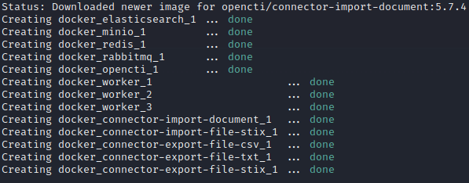  

3. Перейдем в веб-интерфейс OpenCTI:

    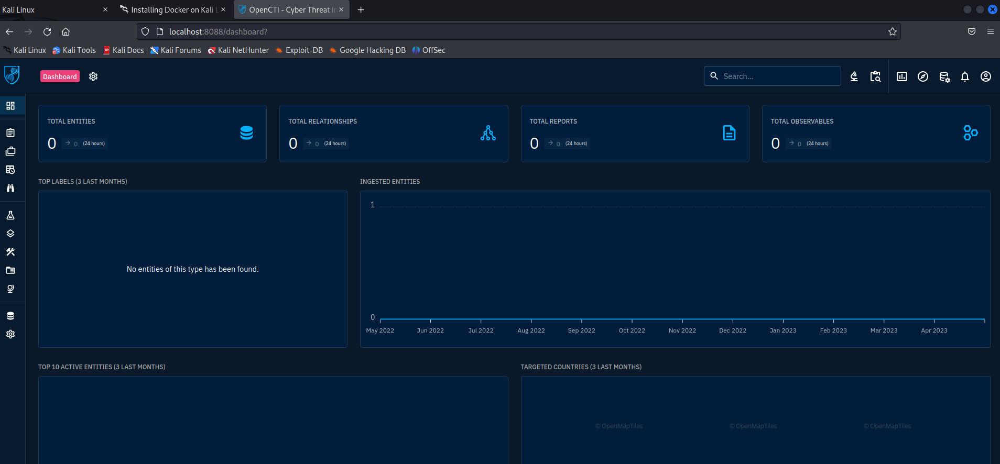  

4. Зайдем на сайт с документацией по импорту файлов и увидем, что существует библиотека python для работы с OpenCTI. Напишем код для импорта файла в opencti:

    ```
    import pycti
    from datetime import datetime

    date = datetime.today().strftime("%Y-%m-%dT%H:%M:%SZ")

    api_url = 'http://localhost:8080'
    api_token = '88ce2416-b1d8-468e-bd2f-974737cf3876'
    client = pycti.OpenCTIApiClient(api_url, api_token)

    with open('hosts.txt', 'r') as f:
        domains = f.read().splitlines()
    k = 1
    for domain in domains:
        indicator = client.indicator.create(
        name="HOST number  {}".format(k),
        description="For pr5 RTU MEMREA",
        pattern_type="stix",
        pattern="[domain-name:value = '{}']".format(domain),
        x_opencti_main_observable_type="IPv4-Addr",
        valid_from=date,
        update=True,
        score=75,
        )
        print("Created indicator with ID:", indicator["id"])
        k += 1


    ```

    Ответ:
    
    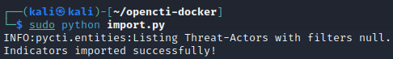  

      

5. Преобразуем все индикаторы в Observables:

    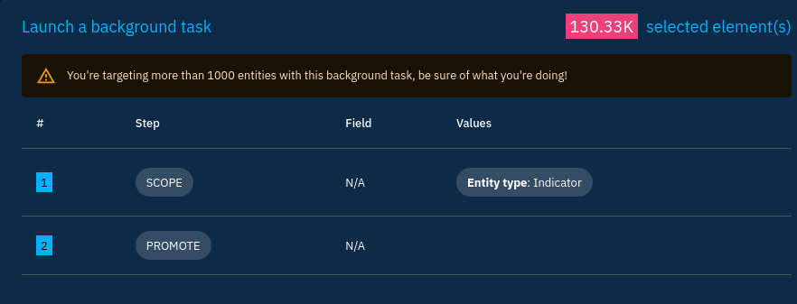  

    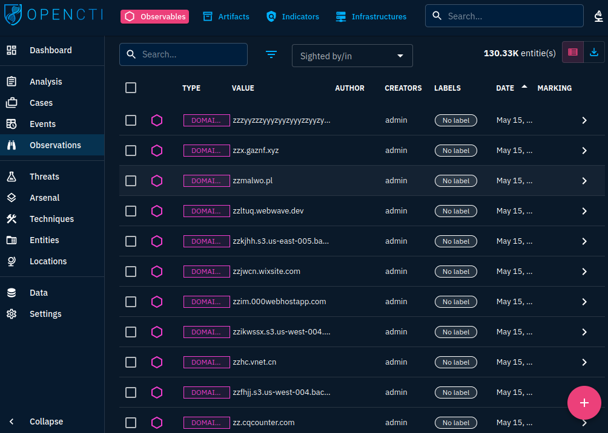  

6. Импортируем сетевой трафик, полученный в lab_2 в OpenCTI:

    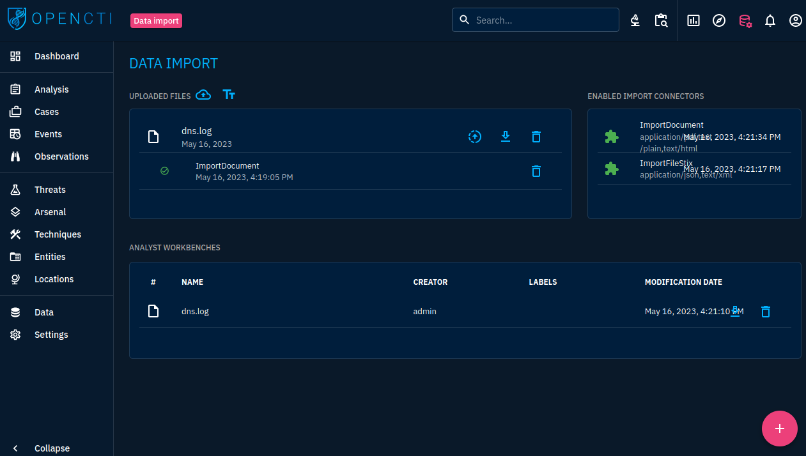  

7. Добавим этот файл в рабочую область:

    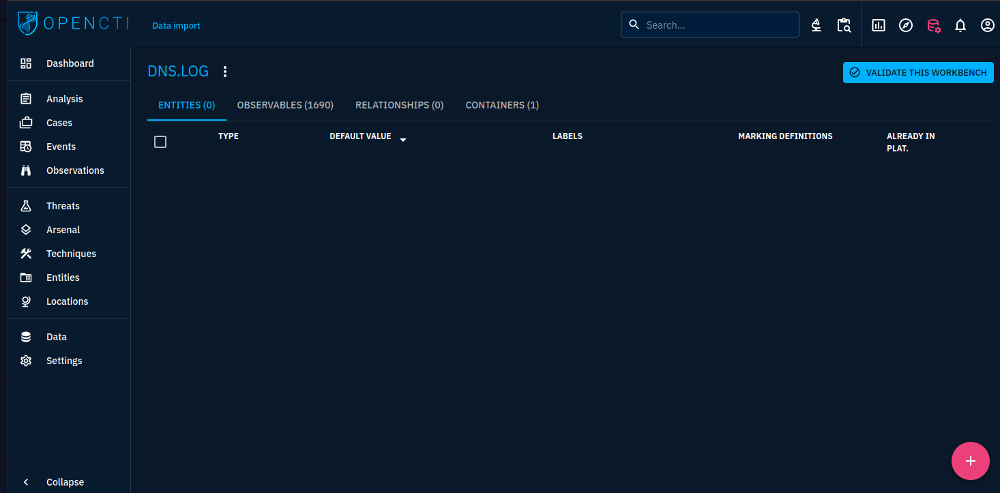  

8. Перейдем в раздел с анализом и отфильтруем поиск по нежелательному траффику:

    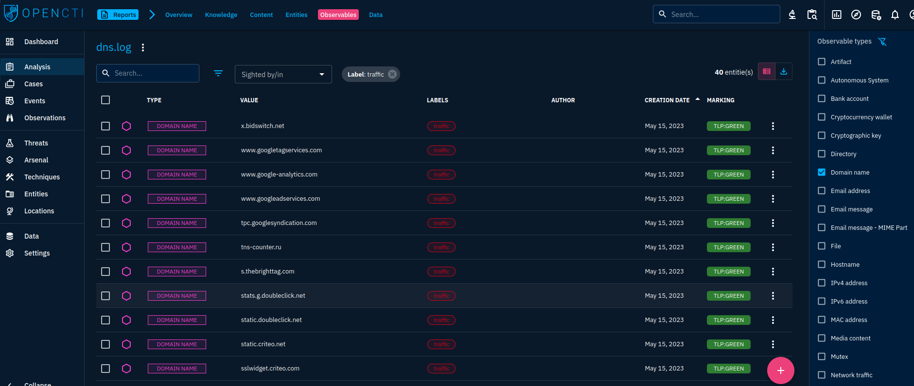  

    Отсюда выясняем, что пользователь посетил 40 нежелательных доменов.

## Оценка результата

В результате лабораторной работы с помощью платформы OpenCTI удалось проанализировать трафик на предмет перехода по нежелательным доменам.

# Выводы

По итогу лабораторной работы были изучены возможности работы с платформой threat intelligence OpenCTI.
